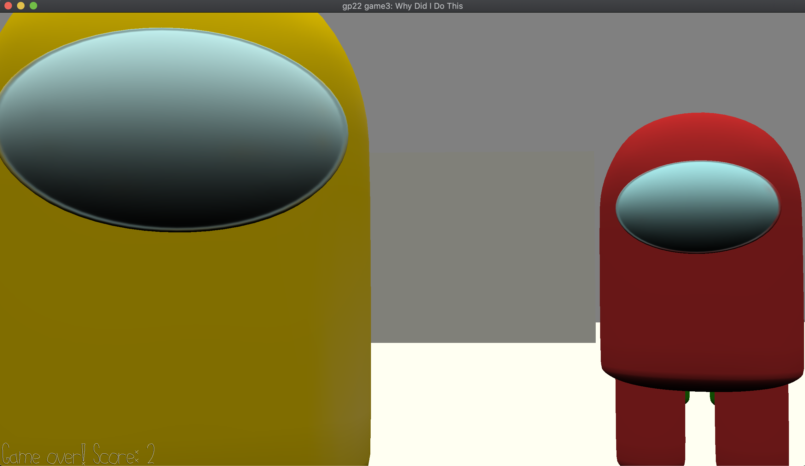

# Why Did I Do This

## Author: Dakota Hernandez (dshernan)

## Design: 

The game has the player fight off against endless waves of incoming enemies! The enemies can only be defeated with a specific sound weapon. Jam out to the game's incredible soundtrack.

## Screen Shot:

## How To Play:

- Use the mouse to look around.
- Buttons 1, 2, and 3 are used for attacking with sound effects 1, 2, and 3.
  - Enemies' colors indicate which sound to use to defeat them.
  - The hit detection is extremely crude; you can only shoot the closest enemy to you, and you can't shoot them in the face mask.
- If an enemy touches you, it's game over!

## Extra Notes:

If I had more time, I would have wanted the enemies to make their own sounds to indicate how the player should respond. However, I couldn't think of a clever way to implement this without flooding the player with sound.

Also, I made the among us characters because I knew there would be a plethora of blender tutorials for how to make them. I gave them rigs but then I realized that's not how we animate things here.

This game was built with [NEST](NEST.md).
